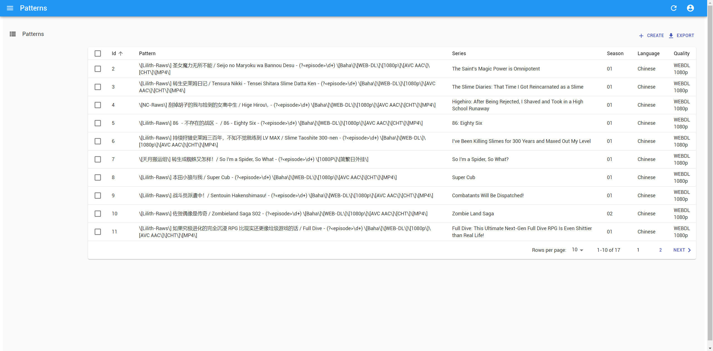
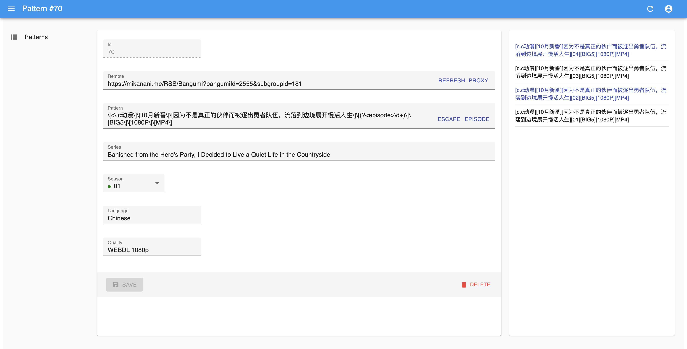

# Mikanarr

[](https://circleci.com/gh/std4453/mikanarr/tree/master)

*Mikanarr* 由 *Mikan Anime* 与 *Sonarr* 混合而成，负责打通两者之间的桥梁，作为自动下载动画的关键一步存在。

关于整个媒体栈的详细信息，请参考 [我的博客](https://blog.std4453.com:444/nas-from-zero-media-part/) ，本文件仅阐述项目的使用方法。

## 简介

[Sonarr](https://sonarr.tv/) 基于 RSS 推送寻找符合需求的发布（*Release*）并下载，然而， [Mikan Anime](https://mikanani.me/) 的 RSS 推送格式与 Sonarr 接受的格式并不兼容，因此我们在前者的返回格式上进行变换，以符合后者的要求。

此外， Sonarr 基于 RSS 推送项目的标题（*Title*）对项目对应的剧集、语言、制式进行识别，然而该识别算法并非完美，在标准化程度较差的日本动画中译领域尤甚，因此我们也对标题进行变换，以保证能够被 Sonarr 正确识别并抓取。

该过程要求用户提供标题的模板格式以及对应的语言、制式信息，为了方便管理，我们提供了一套简单的前/后端系统用于操作。

## 使用

首先你需要一个正常运行且可访问的 Sonarr 实例，并 [获取 API Key](https://github.com/Sonarr/Sonarr/wiki/API) 。

接着，创建并填写 `.env` 文件，如：

```env
SONARR_API_KEY=aaaabbbbccccddddeeeeffff1145141919810
SONARR_HOST=https://sonarr.yourdomain.com
ADMIN_USERNAME=mikanarr
ADMIN_PASSWORD=your_admin_password
```

`ADMIN_USERNAME` 和 `ADMIN_PASSWORD` 用于登陆系统，未登陆无法访问。

然后在data目录创建jwk key

```bash
ssh-keygen -t rsa -b 4096 -E SHA512 -m PEM -f jwt.key
openssl rsa -in jwt.key -pubout -outform PEM -out jwt.key.pub
```

然后运行（需要 Node.js 环境）：

```bash
$ yarn build
$ yarn start
```

将会在 `12306` 端口运行服务器。

此时，可以访问 `http://localhost:12306` 进入 Mikanarr 网页端：



在网页中，你可以搜索、排序、添加、删除、编辑条目，主要需要填写的字段包括：

- `Remote`: 远程地址，即 Mikan Anime 中对应剧集 （可以包含字幕组） 的 RSS 推送地址，选填。
- `Pattern`: 标题模板，只有匹配至少一条的项目会被返回，模板本身为 [正则表达式](https://en.wikipedia.org/wiki/Regular_expression) ，表达式中需要包含 [命名捕获组](https://developer.mozilla.org/en-US/docs/Web/JavaScript/Guide/Regular_Expressions/Groups_and_Ranges) （即 `(?<episode>\d+)` )，用于提供剧集信息。
- `Series`: 系列名称，网页端会从 Sonarr 获取所有系列名称，如果没有找到需要的系列，可能需要首先在 Sonarr 中添加系列。
- `Season`: 季度代码，网页端会从 Sonarr 获取所有季度，并显示其监视状态。
- `Language`: 语言，为剧集对应语言的英文名，如 `Chinese`，需要符合系列所需的语言设定，否则无法被 Sonarr 抓取。
- `Quality`: 质量，可用的值可以参考 [Sonarr 源码](https://github.com/Sonarr/Sonarr/blob/develop/src/NzbDrone.Core/Parser/QualityParser.cs) ，Sonarr 似乎不支持对 RSS 推送的项目自动检测质量，网页端默认填写的值为 `WEBDL 1080p`。

在创建和编辑页面中，侧边栏会自动根据 *Remote* 字段中的地址获取 RSS 推送中的项目，并高亮显示与模板所匹配的项目：



注意， `Pattern` 的内容为 **正则表达式** ，而种子标题中常见的 `[]` 为正则表达式中的特殊字符，需要进行转义处理，你可以点击输入框后的 ESCAPE 按钮快速转义输入框中的内容，或点击 EPISODE 按钮快速复制剧集的命名捕获组。

举例说明，如果你想要抓取的剧集标题为：

```
[Lilith-Raws] 如果究极进化的完全沉浸 RPG 比现实还更像垃圾游戏的话 / Full Dive - 03 [Baha][WEB-DL][1080p][AVC AAC][CHT][MP4]
```

将其黏贴到输入框后点击 ESCAPE，你会得到：

```
\[Lilith-Raws\] 如果究极进化的完全沉浸 RPG 比现实还更像垃圾游戏的话 / Full Dive - 03 \[Baha\]\[WEB-DL\]\[1080p\]\[AVC AAC\]\[CHT\]\[MP4\]
```

然后点击 EPISODE ，将框内的 `03` 替换为复制的内容，得到：

```
\[Lilith-Raws\] 如果究极进化的完全沉浸 RPG 比现实还更像垃圾游戏的话 / Full Dive - (?<episode>\d+) \[Baha\]\[WEB-DL\]\[1080p\]\[AVC AAC\]\[CHT\]\[MP4\]
```

再正确填入其他字段，你就完成了一条抓取模板的编辑。

当然，更方便的方法是找到 Mikan Anime 上对应的 RSS 推送地址，填入 *Remote* 字段后，在侧边栏中选择所需的条目，即可完成前两步操作。

---

为了获取变换后的的 RSS 推送，你可以将 Mikan Anime 的域名部分（`mikanani.me`）直接替换为 Mikanarr 部署的域名，比如从：

```
https://mikanani.me/RSS/MyBangumi?token=<你的个人Token>
```

得到：

```
https://<Mikanarr域名>/RSS/MyBangumi?token=<你的个人Token>
```

将这一地址添加到 Sonarr 中，就能让他自动抓取你想要的剧集了，酷吧？

如果你填入了 *Remote* 字段，也可以点击 *PROXY* 按钮一键拷贝。

## 其他

### 部署

你可以使用 [Docker](https://www.docker.com/) 进行部署，我们的 Docker Image 在 [`izumiko/mikanarr`](https://hub.docker.com/r/izumiko/mikanarr) 。

构建得到的镜像不包含 `.env` 文件，你需要把它放入下面的 `data/` 文件夹。

此外，数据文件不应包含在 Docker Image 和 Docker Container 中，你应当从宿主机将数据文件夹 `data/` 挂载到容器中的 `/data` 。

如果你使用 `docker-compose` ，这里有一份 `docker-compose.yml` 模板：

```yaml
version: "3"

services:
  mikanarr:
    image: izumiko/mikanarr
    volumes:
      - /path/on/host/data:/data
    environment:
      - PUID=1000
      - PGID=100
    expose:
      - 12306/tcp
    restart: unless-stopped
```

这会使用同一份 `.env` 文件启动应用。

### 安全

- `/RSS` 开头的路径会用于转换 RSS 推送。
- `/proxy` 用于允许前端请求 Mikan Anime 的 RSS 推送地址，仅允许请求 `https://mikanani.me` 域名下的 URL 。
- `/sonarr` 用于反代对 Sonarr API 的请求，避免客户端保存 API Key 。
- `/api` 开头的路径用于访问和操作数据。
- 其他地址会得到 `build/` 下的对应静态文件，未找到则会得到 `index.html` 。由于前端使用了 Hash Router ，所有前端 HTML 请求应当仅访问 `/` 路径。

考虑到实现的简单性，我们并没有对服务器进行访问控制，你可以基于上面的描述自行添加访问控制，比如 [HTTP Basic Auth](https://developer.mozilla.org/en-US/docs/Web/HTTP/Authentication) 。其中 `/RSS` 下的路径需要由 Sonarr 访问，无法使用 HTTP Auth ，且不会直接暴露用户数据，可以考虑不进行访问控制。

### 开发

我们使用同一个 `package.json` 同时覆盖前端和后端代码，这不是良好的实践，但很方便。

除此之外，以下文件构成一个基本的 [`create-react-app`](https://create-react-app.dev/) 应用：

```
src/
public/
build/   （构建得到）
```

以下文件仅为后端代码使用：

```
server/  
data/   （数据文件）
.env    （配置文件）
```

进行前端开发时，你可以使用 `yarn dev:web` ，它使用 `react-scripts dev` 在本地启动一个 Dev Server 。

为了访问后端 API ，前端开发时需要有一个运行中的后端服务器，你可以使用 `yarn dev:server` 或者直接 `yarn start` 来启动一个。我们假定开发时的后端地址为 `http://localhost:12306` ，你也可以更改 `package.json` 中的 `proxy` 字段来更改。

`yarn dev:server` 也用于开发后端代码，它会使用 [`nodemon`](https://nodemon.io/) 监听 `server/` 中的文件，当文件改变时自动重启服务器。开发后端时不需要运行中的前端实例。

构建完成之后后端服务器会直接 serve 前端代码，届时只需要 `yarn start` 启动一份。

## 作者

张海川 - Haichuan Zhang - [me@std4453.com](mailto:me@std4453.com) - [Homepage](https://blog.std4453.com:444)
